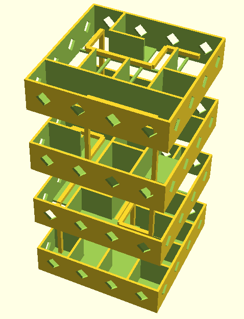
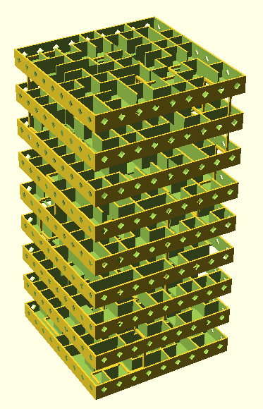
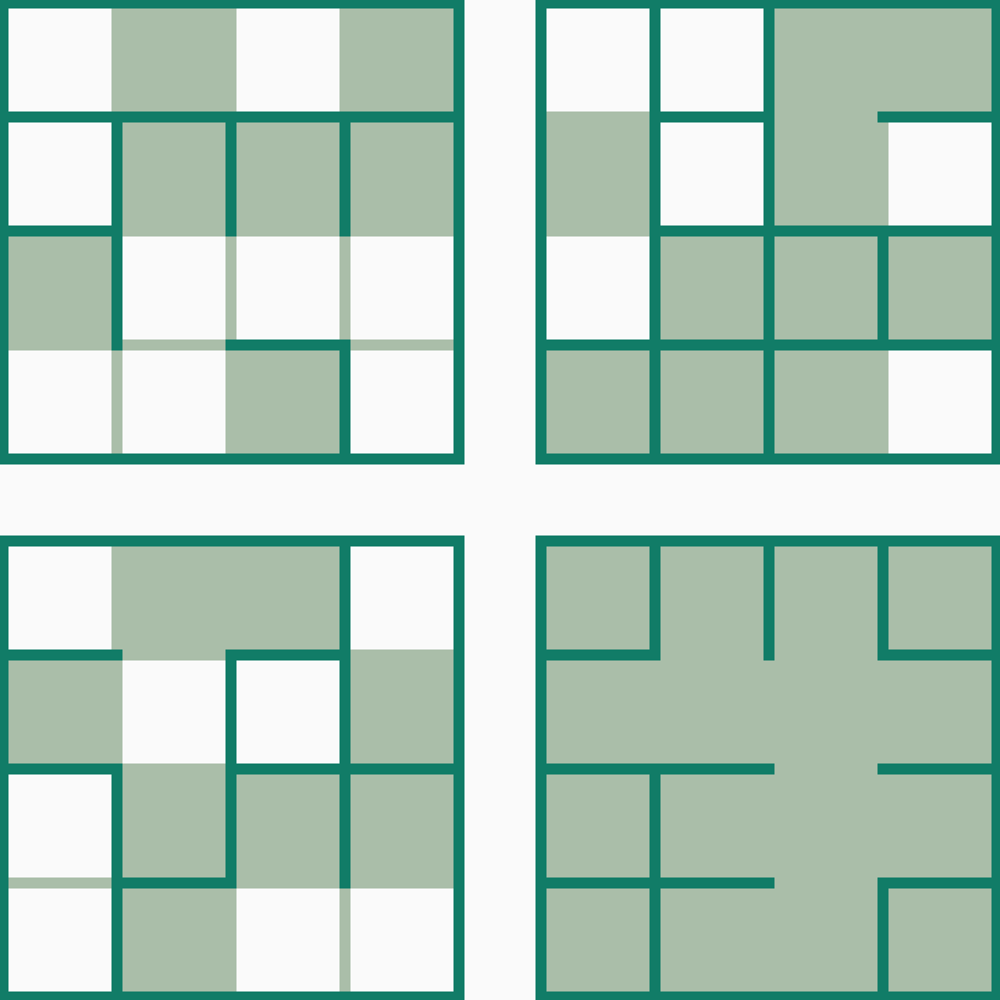

# Labyrinth Cube Generator
This generates a 3D model of a labyrinth cube.  
It consists of multiple floors that are stacked to form the complete labyrinth.  

Multiple Parameters can be adusted:  
* Cell Size
* Number of Cells n: n*n\*n cube
* Wall and Floor Thickness
* Casing Thickness and Tolerance

Example 4x4x4 and 9x9x9 labyrinths with the solution path visualized:

Floorplan for the 4x4 Labyrinth.   
Automatically generated using `python3 -m main config03 ./output03 --map`.  
Can be printed to facilitate solving labyrinth.

## Dependecies
* python: solidpython, numpy, json
* openscad for STL file generation    

## Usage
Print help:  

      python3 -m main -h

Generate .stl files:

      python3 -m main config01 ./output01 --stl

Generate .scad files for labyrinth inspection (view using openscad):

Path from corner to corner:

      python3 -m main config01 ./output01 --vp 
      
Fit in casing:
      
      python3 -m main config01 ./output01 --vc